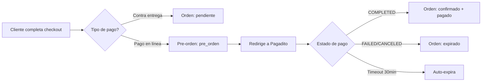

# 🚀 **MEJORAS AL SISTEMA DE ÓRDENES Y PAGADITO**

## 🎯 **PROBLEMAS SOLUCIONADOS**

### **❌ Problemas Anteriores:**
1. **Órdenes se creaban antes del pago** → Aparecían como "pendientes" aunque no se pagaran
2. **Estados no se actualizaban** correctamente desde Pagadito 
3. **Órdenes abandonadas** se quedaban indefinidamente en la BD
4. **No había timeout** para órdenes no pagadas
5. **Dashboard admin mostraba** órdenes fantasma

### **✅ Soluciones Implementadas:**

---

## 📦 **SISTEMA DE PRE-ÓRDENES**

### **Nuevo Estado: `pre_orden`**
- **Propósito:** Órdenes en proceso de pago que aún no están confirmadas
- **Duración:** 30 minutos para completar el pago
- **Comportamiento:** No aparecen en el dashboard principal de admin

### **Flujo Mejorado:**


---

## ⏰ **SISTEMA DE EXPIRACIÓN**

### **Timeout Automático:**
- **Duración:** 30 minutos desde la creación
- **Campo:** `fecha_entrega_estimada` usado como timestamp de expiración
- **Verificación:** Cada 5 minutos vía comando `orders:expire-pre-ordenes`

### **Comando de Limpieza:**
```bash
php artisan orders:expire-pre-ordenes
```

**Programado automáticamente:**
- Ejecuta cada 5 minutos
- Sin solapamiento (withoutOverlapping)
- En background
- Logs completos para auditoría

---

## 🔄 **ESTADOS MEJORADOS**

### **Nuevos Estados Agregados:**
| Estado | Descripción | Uso |
|--------|-------------|-----|
| `pre_orden` | Procesando pago en línea | Temporal, 30 min máx |
| `expirado` | Pre-orden que no se pagó | Permanente, ignorada |

### **Estados Existentes Mejorados:**
| Estado | Antes | Ahora |
|--------|-------|-------|
| `pendiente` | Pago en línea sin pagar | Solo contra entrega |
| `confirmado` | Manual | Auto al completar pago |
| `cancelado` | Manual | Auto en fallos de pago |

---

## 📊 **DASHBOARD FILTRADO**

### **Vista Admin:**
- **Por defecto:** No muestra pre-órdenes ni expiradas
- **Opción:** `?mostrar_pre_ordenes=1` para ver todas
- **Estadísticas:** Excluyen pre-órdenes y expiradas

### **Vista Cliente:**
- **No muestra:** Órdenes expiradas
- **Muestra:** Pre-órdenes como "Procesando Pago"
- **Estadísticas:** Solo órdenes válidas

---

## 🔧 **ARCHIVOS MODIFICADOS**

### **1. Base de Datos:**
- ✅ `database/migrations/2025_08_13_030615_add_pre_orden_estado_to_orders_table.php`
- ✅ Nuevos estados: `pre_orden`, `expirado`

### **2. Modelos:**
- ✅ `app/Models/Order.php`
  - Métodos: `hasExpired()`, `expire()`, `confirmPayment()`
  - Scopes: `preOrdenes()`, `expiradas()`
  - Badges y textos actualizados

### **3. Controladores:**
- ✅ `app/Http/Controllers/ShopController.php`
  - Pre-órdenes con timeout de 30 min
  - Estado inicial: `pre_orden` para pagos en línea
  
- ✅ `app/Http/Controllers/PagaditoController.php`
  - Validación de pre-órdenes
  - Verificación de expiración
  - Estados actualizados correctamente
  
- ✅ `app/Http/Controllers/OrderController.php`
  - Filtrado de pre-órdenes en dashboard
  - Opción para mostrar todas
  
- ✅ `app/Http/Controllers/UserOrderController.php`
  - Excluye órdenes expiradas para usuarios
  - Estadísticas corregidas

### **4. Comandos:**
- ✅ `app/Console/Commands/ExpirePreOrdenes.php`
- ✅ `routes/console.php` - Programación automática

---

## 🧪 **TESTING DEL NUEVO FLUJO**

### **Caso 1: Pago Exitoso**
1. Cliente completa checkout → Pre-orden creada
2. Redirige a Pagadito → Cliente paga
3. Pagadito confirma → Orden se convierte en confirmada
4. ✅ **Resultado:** Cliente ve orden pagada, admin ve orden confirmada

### **Caso 2: Pago Fallido**
1. Cliente completa checkout → Pre-orden creada
2. Redirige a Pagadito → Cliente cancela/falla
3. Pagadito notifica fallo → Pre-orden se marca como expirada
4. ✅ **Resultado:** No aparece en dashboard, cliente puede crear nueva

### **Caso 3: Abandono de Pago**
1. Cliente completa checkout → Pre-orden creada
2. Redirige a Pagadito → Cliente cierra ventana
3. Pasan 30 minutos → Comando auto-expira la pre-orden
4. ✅ **Resultado:** Se limpia automáticamente

### **Caso 4: Contra Entrega**
1. Cliente completa checkout → Orden normal (pendiente)
2. No pasa por Pagadito → Flujo tradicional
3. ✅ **Resultado:** Funciona igual que antes

---

## 📈 **BENEFICIOS**

### **Para Administradores:**
- ✅ **Dashboard limpio** - No más órdenes fantasma
- ✅ **Estadísticas precisas** - Solo órdenes reales
- ✅ **Logs completos** - Auditoría de todos los pagos
- ✅ **Mantenimiento automático** - Sin intervención manual

### **Para Clientes:**
- ✅ **Proceso claro** - Estados descriptivos
- ✅ **Sin confusión** - No ven órdenes expiradas
- ✅ **Segunda oportunidad** - Pueden crear nueva orden si fallan

### **Para el Sistema:**
- ✅ **Performance** - BD más limpia
- ✅ **Confiabilidad** - Estados consistentes
- ✅ **Escalabilidad** - Limpieza automática
- ✅ **Monitoreo** - Logs detallados

---

## 🔒 **SEGURIDAD Y AUDITORÍA**

### **Logs Completos:**
- Creación de pre-órdenes
- Intentos de pago
- Confirmaciones exitosas
- Fallos y cancelaciones
- Expiraciones automáticas

### **Validaciones:**
- Pre-órdenes pertenecen al usuario
- Verificación de expiración antes de pagar
- Estados consistentes en toda la aplicación

---

## 🎉 **¡SISTEMA ROBUSTO COMPLETADO!**

### **Antes:**
- ❌ Órdenes sin pagar aparecían como pendientes
- ❌ Estados inconsistentes
- ❌ Acumulación de órdenes fantasma

### **Ahora:**
- ✅ **Pre-órdenes temporales** con expiración automática
- ✅ **Estados consistentes** y descriptivos
- ✅ **Dashboard limpio** y estadísticas precisas
- ✅ **Mantenimiento automático** cada 5 minutos
- ✅ **Logs completos** para auditoría

**¡Tu sistema de órdenes y Pagadito ahora es completamente robusto y profesional!** 🚀
